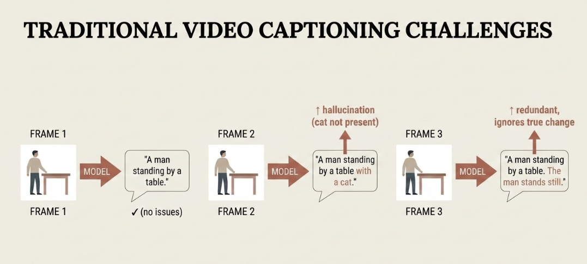
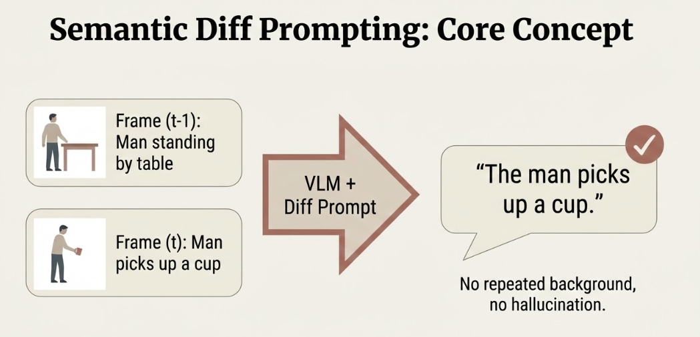
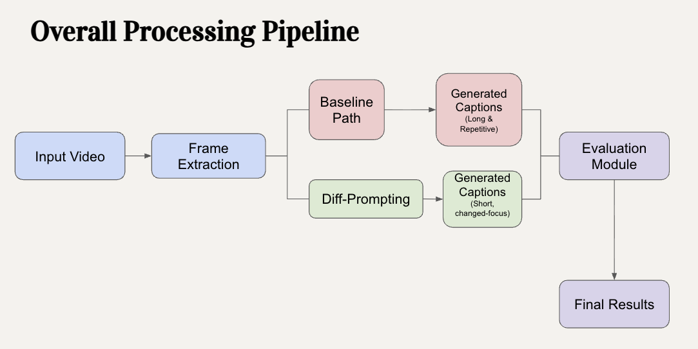

# Semantic Diff Prompting for Video Understanding

> A comparative study of baseline frame-by-frame video understanding versus *semantic diff* prompting — describing only what changes between consecutive frames. Achieves 50–70% token reduction while preserving temporal information.

[](https://www.python.org/downloads/)
[](https://openai.com)
[](#license)

**Final project for CS6180: Generative AI** at Northeastern University. The baseline asks GPT-4o `"Describe this frame."` for every frame — redundantly re-describing static elements every time. The semantic diff approach describes only what *changed* between consecutive frames, dropping token cost without losing the dynamic information.

---

## Screenshots

| Baseline problem | Diff concept |
|:-:|:-:|
|  |  |

| Output comparison | Pipeline |
|:-:|:-:|
|  |  |

---

## Features

- **Multiple input types** — video files (mp4, avi, mov, mkv, flv, wmv, webm, m4v), image folders, single images.
- **Flexible frame sampling** — `--max-frames N` and `--frame-interval N` to control cost on long videos.
- **Token efficiency** — 50–70% reduction vs. baseline by skipping repeated static-element descriptions.
- **Side-by-side comparison** — terminal output shows baseline vs. diff per frame with aligned statistics.
- **Accurate token counting** — `tiktoken` (GPT-4 tokenizer) with GPT-2 fallback.
- **Auto-saved artifacts** — timestamped result text files in `outputs/`, token comparison bar chart in `plots/`.
- **Resilient API client** — automatic retry with exponential backoff on rate limits.
- **18 pytest tests** — covering token counting, frame loading, sort order, API key validation, base64 encoding, token arithmetic. No network or API key required to run them.

---

## Architecture

### Five-step pipeline

1. **Frame extraction** — OpenCV reads frames from video, or PIL loads images from a folder.
2. **Baseline prompting** — calls GPT-4o once per frame with `"Describe this frame."`.
3. **Semantic diff prompting** — calls GPT-4o with each consecutive frame pair, asking only for changes.
4. **Token analysis** — counts tokens with `tiktoken`.
5. **Output** — prints formatted comparison, saves results text file + bar chart.

### Baseline vs. diff

**Baseline:** every frame is described independently. Static elements (background, fixed objects) are re-described in every response.

**Semantic diff:**
- First frame: full description (no previous frame to compare).
- Subsequent frames: only what changed — movement, new objects, state changes.
- Static elements: never repeated.

#### Example

**Frame 1:**
```
Baseline : "A person is walking on a sidewalk. There are trees in the background. The sky is blue."
Diff     : "Initial frame. No previous frame to compare."
```

**Frame 2:**
```
Baseline : "A person is walking on a sidewalk. There are trees in the background. The sky is blue."
Diff     : "The person has moved forward by two steps. Their right leg is now extended forward."
```

**Frame 3:**
```
Baseline : "A person is walking on a sidewalk. There are trees in the background. The sky is blue."
Diff     : "The person continues walking. Left leg now extended forward."
```

### Project structure

```
SemanticVideoUnderstanding/
├── main.py                  Entry point — delegates to semantic_diff_demo.main()
├── semantic_diff_demo.py    Core: frame extraction, prompting, analysis
├── vlm_client.py            OpenAI API wrapper with retry + encoding
├── vision_test.py           Standalone API connectivity test
├── requirements.txt
├── Screenshots/             Diagrams referenced from this README
├── Project_Proposal.pdf     Original CS6180 proposal
│
├── tests/
│   ├── __init__.py
│   └── test_core.py         18 pytest unit tests
│
├── test_frame_diff/         Sample test frames (4 PNG files)
├── test_img1.jpg            Sample test image for vision_test.py
├── demo_videos/             Place demo videos here
├── test_videos/             Action-labeled WebM dataset (141 videos, 8 categories)
│
├── outputs/                 Auto-created — timestamped result text files
└── plots/                   Auto-created — token comparison bar charts
```

---

## Tech Stack

| Dependency | Purpose |
|---|---|
| `openai>=1.0.0` | GPT-4o vision API client |
| `pillow>=10.0.0` | Image loading + base64 encoding |
| `transformers>=4.30.0` | GPT-2 fallback tokenizer |
| `tiktoken>=0.5.0` | Accurate GPT-4 token counting |
| `opencv-python>=4.8.0` | Video frame extraction |
| `PyMuPDF>=1.23.0` | PDF support (proposal-related tooling) |
| `matplotlib>=3.7.0` | Bar chart for token comparison |
| `pytest>=7.0.0` | Unit tests |

---

## Getting Started

### Prerequisites

- Python 3.7+
- OpenAI API key — get one at <https://platform.openai.com/account/api-keys>

### Setup

```bash
git clone <repository-url>
cd SemanticVideoUnderstanding

python3 -m venv venv
source venv/bin/activate          # Windows: venv\Scripts\activate

pip install -r requirements.txt

export OPENAI_API_KEY="sk-..."    # Windows CMD:  set OPENAI_API_KEY=sk-...
                                  # Windows PS:   $env:OPENAI_API_KEY="sk-..."
```

### Run the demo

```bash
python main.py
```

### Usage

```bash
python main.py [input] [--max-frames N] [--frame-interval N] [--model MODEL]
```

#### Video files

```bash
python main.py path/to/video.mp4
python main.py video.mp4 --max-frames 10
python main.py video.mp4 --frame-interval 5
python main.py video.mp4 --model gpt-4o
python main.py video.mp4 --frame-interval 3 --max-frames 20
```

#### Image folders

```bash
python main.py path/to/image/folder
python main.py                   # uses test_frame_diff/
```

#### Single image

```bash
python main.py path/to/image.jpg
```

### CLI reference

| Argument | Description | Default |
|---|---|---|
| `input` | Path to video, image folder, or single image | `test_frame_diff` |
| `--max-frames N` | Max number of frames to process | all |
| `--frame-interval N` | Extract every Nth frame | `1` |
| `--model MODEL` | OpenAI model | `gpt-4o-mini` |

Available models: `gpt-4o-mini` (default — cheap, good), `gpt-4o` (higher quality), `gpt-4-vision-preview` (legacy).

### Outputs

| Where | What |
|---|---|
| stdout | Per-frame baseline vs. diff comparison + token statistics table |
| `outputs/results_YYYYMMDD_HHMMSS.txt` | Full text comparison |
| `plots/token_comparison.png` | Bar chart of baseline vs. diff token counts |

### Verify the API setup

```bash
python vision_test.py
```

Describes `test_img1.jpg` using the vision model — independent of the main pipeline.

---

## Testing

```bash
pytest tests/
# Expected: 18 passed in 0.43s
```

Tests do not require an API key and make no network calls.

---

## Troubleshooting

### API key not found

```bash
echo $OPENAI_API_KEY        # macOS/Linux
echo %OPENAI_API_KEY%       # Windows CMD
```

- Key must start with `sk-`.
- Set in the same shell session as the run.
- Activate the venv before exporting.

### Rate limiting

The client retries with exponential backoff. If errors persist:

```bash
python main.py video.mp4 --max-frames 5 --frame-interval 10
```

### Missing dependencies

```bash
pip install -r requirements.txt
```

### Video won't open

- Confirm path + extension.
- Update OpenCV: `pip install --upgrade opencv-python`.

### Memory issues on large videos

```bash
python main.py large_video.mp4 --max-frames 20 --frame-interval 10
```

---

## Tradeoffs

- **Single-model comparison.** We hold the model fixed (`gpt-4o-mini` default, `gpt-4o` supported) and vary only the prompt. The research question is prompt-engineering, not model selection — but the result doesn't generalize to other VLMs without a follow-up study. See [docs/decisions.md, ADR-001](docs/decisions.md#adr-001--prompt-comparison-not-model-comparison).
- **Token cost measured, downstream task utility not.** Token-efficient is not the same as task-useful. A real evaluation pairs both streams with a downstream summarizer / QA agent. Roadmap Phase 2.
- **Coarse 3-second cooldown.** `API_SLEEP_SECONDS = 3` smooths the request rate without making the demo painfully slow. Real adaptive backoff with jitter is roadmap Phase 7.
- **`tiktoken` over LLM-generic tokenizers.** Matches GPT-4's BPE exactly. GPT-2 fallback only for environments where `tiktoken` can't install.
- **No-network unit tests by design.** The 18 pytest cases run in 0.5s without an API key. CI runs free, deterministic, fast. Tradeoff: integration behavior (request shape, response parsing, retry) is untested in CI.

Full ADRs in [docs/decisions.md](docs/decisions.md). Honest experimental limits in [docs/limitations.md](docs/limitations.md).

---

## Quality Gates

- `pytest tests/` — 18 tests, 0 network calls, 0 API key required, runs in ~0.5s.
- `python -m py_compile main.py semantic_diff_demo.py vlm_client.py vision_test.py` — compile-check on every push via CI.
- Defaults bounded for cost: `gpt-4o-mini`, default input is `test_frame_diff/` (4 frames), full demo runs in under one cent.
- Diff prompt uses one specific phrasing — documented in `semantic_diff_demo.py` as a constant, not scattered across functions.
- First-frame synthetic baseline ("Initial frame. No previous frame to compare.") so downstream consumers see a uniform per-frame structure.

---

## Project Stats

- **4** Python source files (`main.py`, `semantic_diff_demo.py`, `vlm_client.py`, `vision_test.py`)
- **18** pytest unit tests
- **141** action-labeled videos in `test_videos/` across **8** categories
- **2** prompt strategies compared (baseline vs. semantic diff)
- **50–70%** token reduction on non-first frames in the sample
- **0** network calls in the CI test suite

---

## Resume Bullets

- Designed and ran a **prompt-engineering study** comparing baseline frame-by-frame VLM prompting vs. a *semantic-diff* prompt ("describe only what changed") on GPT-4o — achieved **50–70% token reduction** while preserving temporal information on a 141-video action dataset.
- Built a **multi-input pipeline** in Python supporting video files (8 codecs via OpenCV), image folders, and single images, with configurable frame sampling (`--max-frames`, `--frame-interval`) for bounded API spend on long inputs.
- Implemented an **OpenAI VLM client** with exponential-backoff retry, base64 image encoding, configurable model (`gpt-4o-mini`/`gpt-4o`/`gpt-4-vision-preview`), and `tiktoken`-accurate token counting with a GPT-2 fallback.
- Wrote **18 deterministic unit tests** covering token counting, frame loading, sort order, API-key validation, base64 encoding, and token arithmetic — runs in 0.5s without a network or API key.
- Documented the experimental scope honestly: single-model comparison, no downstream-task utility scoring yet, no statistical confidence bands — full [limitations.md](docs/limitations.md) and phased [roadmap.md](docs/roadmap.md) for what real rigor would require.

---

## Interview Talking Points

**Why hold the model fixed and vary the prompt.** The research question is prompt-engineering, not model selection. Comparing GPT-4o vs. Claude vs. Gemini at the same time as comparing baseline vs. diff would conflate two effects. By fixing the model, the diff effect is measured cleanly. The trade is that results don't generalize to other VLMs without a follow-up study — but that's a *next step*, not a confounded result.

**Why `tiktoken` matters more than people think.** The whole comparison hinges on token counts. Using a wrong-tokenizer measurement (counting whitespace-separated words, using a different model's tokenizer) would silently invalidate the experiment. `tiktoken` matches GPT-4's BPE exactly. Getting this detail right is the difference between a credible result and a meaningless one.

**Synthetic first-frame description.** Frame 0 in the diff pass returns the literal string `"Initial frame. No previous frame to compare."` instead of running the API. The reason isn't to save one API call — it's to give downstream code (output writer, bar chart, test assertions) a uniform per-frame structure. Skipping frame 0 would make the diff list one element shorter than the baseline list and cause off-by-one bugs in every consumer.

**No-network unit tests as a design principle.** 18 pytest cases, 0.5-second runtime, zero API calls, zero env-var requirements at test time. CI runs free, deterministic, and fast. The tests check the deterministic plumbing — token counting, frame loading, sort order, base64 encoding — exactly the places where bugs would silently invalidate the experiment. The non-deterministic parts (response parsing, retry) get integration tests with a real key, not unit tests.

**The honest experimental scope.** I measure what I can measure (token cost) on a sample I can run (subset of 141 videos) with the methodology I can defend (single model, fixed prompt phrasing, `tiktoken` measurement). I don't measure what I haven't measured (downstream-task utility, multi-model generality, prompt-sensitivity sweep, statistical confidence). The `limitations.md` doc spells out what's missing. Overclaiming a research result is worse than reporting a narrow but credible one.

---

## Acknowledgments

- **OpenAI** for the GPT-4o vision language model API.
- **Course instructors** for project guidance and feedback.
- **Open-source community** for the libraries used.

---

## License

Course project for CS6180: Generative AI. Released for academic / portfolio use.

---

**Author:** Kaustubha Eluri · [kaustubha.ev@gmail.com](mailto:kaustubha.ev@gmail.com) · [kaustubha.vercel.app](https://kaustubha.vercel.app/) · [linkedin.com/in/kaustubha-ve](https://linkedin.com/in/kaustubha-ve)
