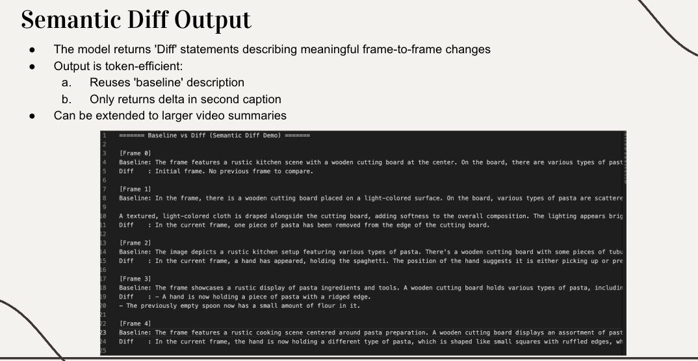

# Semantic Diff Prompting for Video Understanding

> **Final Project for CS6180: Generative AI**

A comparative study of baseline frame-by-frame video understanding versus semantic diff prompting, demonstrating significant token reduction while preserving temporal information.

[](https://www.python.org/downloads/)
[](https://openai.com/)

---

## Table of Contents

- [Overview](#overview)
- [Quick Start](#quick-start)
- [Usage](#usage)
- [How It Works](#how-it-works)
- [Features](#features)
- [Project Structure](#project-structure)
- [Requirements](#requirements)
- [Testing](#testing)
- [Troubleshooting](#troubleshooting)

---

## Overview

This project implements and compares two approaches to video understanding using vision language models:

- **Baseline Approach**: Each frame is described independently, leading to redundant information across frames
- **Semantic Diff Approach**: Only changes between consecutive frames are described, reducing token consumption while maintaining temporal dynamics

> **Demo**: Try the project with any video. Place it in `demo_videos/` and run:
> ```bash
> python main.py demo_videos/your_video.mp4 --max-frames 10
> ```

### Key Benefits

- **Token Efficiency**: Achieves 50-70% token reduction compared to baseline methods
- **Cost Savings**: Lower API costs due to reduced token usage
- **Temporal Focus**: Captures dynamic changes while ignoring static elements
- **Visual Output**: Token comparison chart saved automatically to `plots/`
- **Comprehensive Comparison**: Side-by-side analysis of both approaches with formatted statistics

---

## Quick Start

### Prerequisites

- Python 3.7 or higher
- OpenAI API key ([Get one here](https://platform.openai.com/account/api-keys))

### Installation

1. **Clone the repository**
   ```bash
   git clone <repository-url>
   cd SemanticVideoUnderstanding
   ```

2. **Create a virtual environment** (recommended)
   ```bash
   python3 -m venv venv
   source venv/bin/activate  # On Windows: venv\Scripts\activate
   ```

3. **Install dependencies**
   ```bash
   pip install -r requirements.txt
   ```

4. **Set your OpenAI API key**

   macOS/Linux:
   ```bash
   export OPENAI_API_KEY="sk-your-actual-api-key-here"
   ```

   Windows (Command Prompt):
   ```cmd
   set OPENAI_API_KEY=sk-your-actual-api-key-here
   ```

   Windows (PowerShell):
   ```powershell
   $env:OPENAI_API_KEY="sk-your-actual-api-key-here"
   ```

5. **Run the demo**
   ```bash
   python main.py
   ```

---

## Usage

### Entry Point

All runs go through `main.py`:

```bash
python main.py [input] [--max-frames N] [--frame-interval N] [--model MODEL]
```

`semantic_diff_demo.py` also works directly and exposes the same CLI.

### Input Types

#### Video files

```bash
python main.py path/to/video.mp4
```

Supported formats: `.mp4`, `.avi`, `.mov`, `.mkv`, `.flv`, `.wmv`, `.webm`, `.m4v`

```bash
# Quick test — first 10 frames only
python main.py video.mp4 --max-frames 10

# Sample every 5th frame (useful for long videos)
python main.py video.mp4 --frame-interval 5

# Higher-quality model
python main.py video.mp4 --model gpt-4o

# Combine options
python main.py video.mp4 --frame-interval 3 --max-frames 20
```

#### Image folders

```bash
python main.py path/to/image/folder

# Default test folder
python main.py                   # uses test_frame_diff/
python main.py test_frame_diff   # explicit
```

#### Single image

```bash
python main.py path/to/image.jpg
```

### CLI Reference

| Argument | Description | Default |
|----------|-------------|---------|
| `input` | Path to video file, image folder, or single image | `test_frame_diff` |
| `--max-frames N` | Maximum number of frames to process | all frames |
| `--frame-interval N` | Extract every Nth frame (1 = all, 5 = every 5th) | `1` |
| `--model MODEL` | OpenAI model to use | `gpt-4o-mini` |

**Available models:**
- `gpt-4o-mini` (default) — cost-effective, good performance
- `gpt-4o` — higher quality, higher cost
- `gpt-4-vision-preview` — legacy vision model

### Output

After each run the script produces:

| Output | Location | Description |
|--------|----------|-------------|
| Terminal comparison | stdout | Formatted side-by-side baseline vs. diff per frame |
| Token statistics table | stdout | Aligned table with counts and reduction % |
| Results file | `outputs/results_YYYYMMDD_HHMMSS.txt` | Full frame-by-frame text comparison |
| Token plot | `plots/token_comparison.png` | Bar chart — baseline vs. diff token counts |

### Simple Vision Test

Verify your API setup independently:

```bash
python vision_test.py
```

Describes `test_img1.jpg` using the vision model.

---

## How It Works

The script processes inputs in five steps:

1. **Frame extraction** — reads frames from video (OpenCV) or loads images from folder
2. **Baseline prompting** — calls GPT-4o once per frame with `"Describe this frame."`
3. **Semantic diff prompting** — calls GPT-4o with each consecutive frame pair, asking only for changes
4. **Token analysis** — counts tokens with `tiktoken` (falls back to GPT-2 tokenizer if unavailable)
5. **Output** — prints formatted results, saves text file and bar chart

### Baseline Approach

Each frame is described independently, so static elements (background, fixed objects) are repeated in every response.


### Semantic Diff Approach

Only changes between consecutive frames are described:

- **First frame**: receives a full description (no previous frame to compare)
- **Subsequent frames**: only what changed is described — movement, new objects, state changes
- **Static elements**: background and unchanged objects are never repeated


### Example Comparison

**Frame 1:**
```
Baseline : "A person is walking on a sidewalk. There are trees in the background. The sky is blue."
Diff     : "Initial frame. No previous frame to compare."
```

**Frame 2:**
```
Baseline : "A person is walking on a sidewalk. There are trees in the background. The sky is blue."
Diff     : "The person has moved forward by two steps. Their right leg is now extended forward."
```

**Frame 3:**
```
Baseline : "A person is walking on a sidewalk. There are trees in the background. The sky is blue."
Diff     : "The person continues walking. Left leg now extended forward."
```

The baseline repeats the full scene every frame. The diff describes only motion — a 50-70% token reduction.



### Processing Pipeline


---

## Features

- Multiple input formats: video files, image folders, single images
- Flexible frame sampling: `--max-frames` and `--frame-interval` flags
- Robust error handling: automatic retry with exponential backoff on rate limits
- Accurate token counting: `tiktoken` (GPT-4 tokenizer) with GPT-2 fallback
- Formatted terminal output: aligned token statistics table
- Token comparison plot: bar chart saved to `plots/token_comparison.png`
- Persistent results: timestamped output files in `outputs/`
- Unit tests: 18 pytest tests covering core logic and edge cases

---

## Project Structure

```
SemanticVideoUnderstanding/
├── main.py                  # Entry point — delegates to semantic_diff_demo.main()
├── semantic_diff_demo.py    # Core logic: frame extraction, prompting, analysis
├── vlm_client.py            # OpenAI API wrapper with retry and encoding
├── vision_test.py           # Standalone API connectivity test
├── requirements.txt         # Python dependencies
├── README.md                # This file
├── Project_Proposal.pdf     # Original CS6180 project proposal
│
├── tests/
│   ├── __init__.py
│   └── test_core.py         # 18 pytest unit tests
│
├── docs/images/             # Visual diagrams
│   ├── traditional_challenges.png
│   ├── semantic_diff_concept.png
│   ├── semantic_diff_output.png
│   └── processing_pipeline.png
│
├── test_frame_diff/         # Sample test frames (4 PNG files)
├── test_img1.jpg            # Sample test image for vision_test.py
├── demo_videos/             # Place demo videos here
├── test_videos/             # Action-labeled WebM dataset (141 videos, 8 categories)
│
├── outputs/                 # Auto-created — timestamped result text files
└── plots/                   # Auto-created — token comparison bar charts
```

---

## Requirements

- Python 3.7 or higher
- OpenAI API key

Dependencies (`requirements.txt`):

```
openai>=1.0.0
pillow>=10.0.0
transformers>=4.30.0
tiktoken>=0.5.0
opencv-python>=4.8.0
PyMuPDF>=1.23.0
matplotlib>=3.7.0
pytest>=7.0.0
```

---

## Testing

Unit tests cover token counting, frame loading, sort order, API key validation, base64 encoding, and token reduction arithmetic.

```bash
pytest tests/
```

Expected output:

```
18 passed in 0.43s
```

Tests do not require an OpenAI API key and make no network calls.

---

## Troubleshooting

### API key not found

```bash
# Verify the key is set
echo $OPENAI_API_KEY        # macOS/Linux
echo %OPENAI_API_KEY%       # Windows CMD
```

- Ensure the key starts with `sk-`
- Set it in the same terminal session used to run the script
- Activate your virtual environment before setting the key

### Rate limiting

The script retries automatically with exponential backoff. If errors persist:

```bash
python main.py video.mp4 --max-frames 5 --frame-interval 10
```

### Missing dependencies

```bash
pip install -r requirements.txt
```

### Video won't open

- Confirm the path and file extension are correct
- Supported formats: `.mp4`, `.avi`, `.mov`, `.mkv`, `.flv`, `.wmv`, `.webm`, `.m4v`
- Update OpenCV: `pip install --upgrade opencv-python`

### Memory issues with large videos

```bash
python main.py large_video.mp4 --max-frames 20 --frame-interval 10
```

---

## License

This project is part of a course assignment for CS6180: Generative AI.

---

## Acknowledgments

- **OpenAI** for the GPT-4o vision language model API
- **Course Instructors** for project guidance and feedback
- **Open Source Community** for the libraries used in this project

---

## Contact

**Author:** Kaustubha Eluri

- **Email**: [kaustubha.ev@gmail.com](mailto:kaustubha.ev@gmail.com)
- **Portfolio**: [kaustubha-09.github.io](https://kaustubha-09.github.io)
- **LinkedIn**: [linkedin.com/in/kaustubha-ve](https://linkedin.com/in/kaustubha-ve)

For questions or issues related to this project, feel free to reach out.
